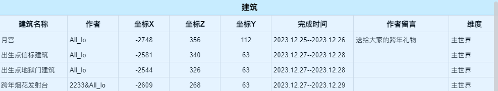
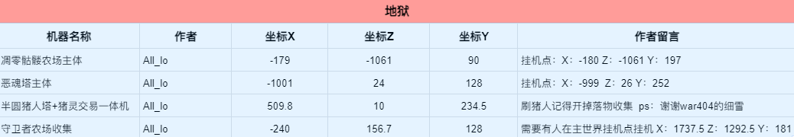
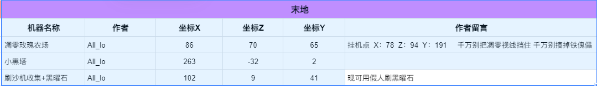

## 服务器介绍

- 服务器地址:`porter.org.cn`
- 服务器版本: `1.18.2`
- 服务器最大人数: `20`
- 服务器介绍: `这是一个 基于 fabric 的 Minecraft 服务器,安装了部分插件,欢迎各位玩家来玩!`

## 已安装的插件

~~~shell
├── Carpet-AMS-Addition-mc1.18.2-v2.22.0.jar
├── carpet-extra-1.18.2-1.4.72.jar
├── carpet-mct-addition-1.18.2-0.1.0.jar
├── carpet-tis-addition-mc1.18.2-v1.55.0.jar
├── collective-1.18.2-7.7.jar
├── fabric-api-0.77.0+1.18.2.jar
├── fabric-carpet-1.18.2-1.4.69+v220331.jar
├── Fastload+1.18.2-1.20-3.4.0.jar
├── gugle-carpet-addition-2.6.0-1.171.18.jar
├── ivan-carpet-addition-mc1.18.2-v2.2.2.jar
├── jline4mcdsrv-0.4.3.jar
├── lazydfu-0.1.2.jar
├── lithium-fabric-mc1.18.2-0.10.3.jar
├── magiclib-1.18.2-0.7.398+fe2125a-stable.jar
├── minitweaks-1.18.2-1.2.3.jar
├── PingMe-fabric-1.0.0+mc1.18.2.jar
├── plusls-carpet-addition-1.18.2-0.2.5.jar
├── quickteleports-1.18.2-1.2.0-fabric [Special Build for Simplified Chinese by six_coin].jar
├── servux-fabric-1.18.2-0.1.0.jar
├── styled-nicknames-1.0.4+1.18.jar
├── styledplayerlist-2.1.3+1.18.jar
├── syncmatica-1.18.2-0.3.11.jar
├── vanish-1.1.0.jar
├── ViaFabric-0.4.12+55-dev.jar
├── ViaVersion-4.9.3-SNAPSHOT.jar
├── vmp-fabric-mc1.18.2-0.2.0+beta.3.126-all.jar
├── 历史聊天chathistory-1.2.1+1.18.1.jar
└── [简单的语音聊天] voicechat-fabric-1.18.2-2.4.32.jar
~~~

## 已完成建筑

### 主世界建筑

### 地狱世界建筑

### 末地世界建筑

## 适合新手的建筑和机器
~~~text
[质检员晓东] 发送了弹幕消息：{我的世界 适合新手造的机器和建筑}
问答Ai：欢迎来到我的直播间，亲爱的粉丝们！关于《我的世界》中适合新手造的机器和建筑，我有一些建议供大家参考。
1. 自动农场：对于新手来说，自动农场是一个很好的选择。你可以使用红石搭建一个简单的自动农场，用来种植作物和收割农作物。这样你就可以在游戏中轻松获得食物资源了。
2. 刷怪塔：刷怪塔是《我的世界》中一个非常有趣的建筑。你可以使用红石和陷阱来搭建一个刷怪塔，让怪物不断地刷新出来，然后击败它们获取经验值和掉落物。
3. 电梯系统：在《我的世界》中，你可以通过搭建一个电梯系统来快速穿越地形。你可以使用红石和活塞来实现这个功能，让你在游戏中更加轻松地探索各个区域。
4. 红石迷宫：红石迷宫是一个非常有趣的挑战。你可以使用红石和活塞来搭建一个复杂的迷宫，然后尝试在其中找到出口。这个过程既考验你的智力，也锻炼你的操作技巧。
5. 末影门：如果你想要进入末地，你需要搭建一个末影门。虽然这个过程可能有些复杂，但是一旦你完成了这个任务，你就可以进入末地，挑战强大的末影龙了。
~~~
